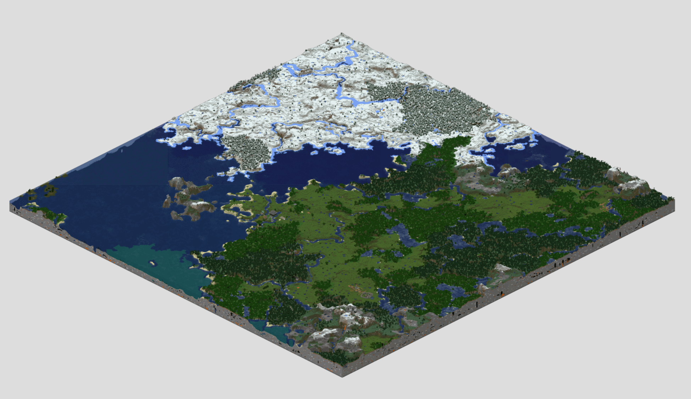

# mc-map
A minecraft map (size 2000x2000) rendered using Mapcrater

The fully rendered minecraft map (size 20000x20000) is available for download from the [release](https://github.com/hanzhi713/mc-map/releases/tag/vfull-map). When decompressed, it takes >100GB of disk space. 

