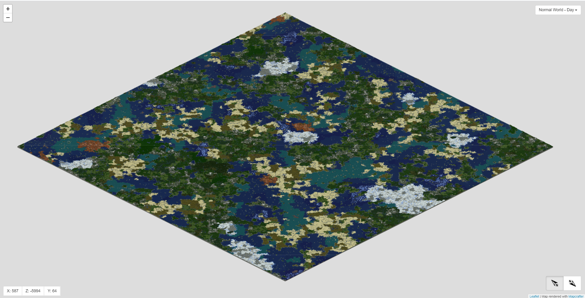

# mc-map
A minecraft v1.13.2 map (size 2000x2000) rendered using Mapcrater. Visit https://hanzhi713.github.io/mc-map/output to view the map. 

The size 20000x20000 render of the same map is available for download from the [release](https://github.com/hanzhi713/mc-map/releases/tag/vfull-map). When decompressed, it takes >100GB of disk space. 

